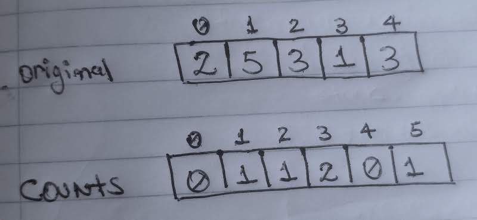
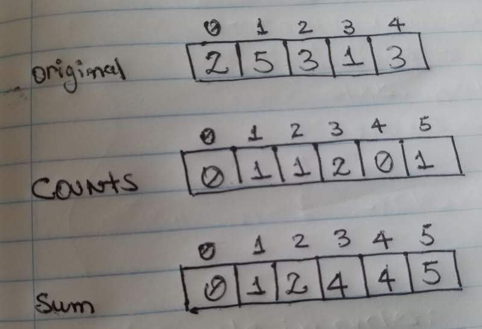

If you have taken an algorithms class or tutorial then I bet there are a few questions that you can answer in the blink of an eye:

- What's the lookup time of arrays? easy, O(1).
- How long does it take to find a number in a binary search tree? O(log n).
- How fast can we sort a list of integers? O(n\*log n).

Those are all valid answers which will make any interviewer/professor happy. Nonetheless, sorting a numeric list is such a common task that computer scientists keep finding ways of improving what was already pretty darn good. Enter [Counting Sort](https://en.wikipedia.org/wiki/Counting_sort), which allows us to sort a numeric list on **linear time** if it satisfies a very particular set of conditions.

Linear time is a big deal when talking about algorithms; it's usually the desired runtime of everything. Hence, it makes sense that everyone will pay attention to a solution that achieves that...even if it doesn't work for all cases.

## The Inner Workings

### Assumptions

Counting sort expects the input list to meet the following requirements:

1. It contains only positive integers.
2. Integers are in a range between 0 and k(inclusive). **K** is the highest number on the list.
3. Knowing the value of k ahead of time.

Regarding point number 3, is it possible to calculate k from the input list? Well...yes, in theory. However, we are aiming for **linear time** and, that takes at least **O(n log n)** time.

### Counting

The first step of counting sort is, no surprise here, Counting! More specifically, we need to count the occurrences of each number in the input array. For storing the counts, we'll build a new collection of length **k+1**; each count goes into the index represented by the number we are counting. For instance, if we have three fives, then index 5 of our count array will have a value of 3. If you are like me, this needs a picture to make sense:



As you can tell, the original array has two threes thus there's a 2 in index 3 of the counts' array and so on. The count's indexes are usually known as **buckets**.

### Running Sum

The next step requires adding each pair of consecutive values in the count array; this is known as the running sum. For example, we add the element on index 0 to the one on index 1, then the value on index 1 plus the one on index 2 and so on.

Remember, this is all happening in our count array, thus we are effectively modifying it with each sum. We'll keep building our running sum and mutating its values until we've reached the end. If our element on index 2 goes from 1 to 2, then the next summation will be 2 plus whatever value it's on index 3.



Hopefully, at this point, you are starting to make some sense out of the count array. Each value denotes the first instance of the element on our sorted listed. We have to keep in my that counting usually starts at one while our arrays are zero-based. So what? We have to decrease each index by one to account for the difference in the starting points.

### Sorted list

Finally, it's time to create our sorted array. You could do this step in place but, I prefer building a new list of the same size as the input. Now, for each integer in our input array:

1. Get it's the first occurrence on the sorted list by pulling its value from the count array: `new_index = count[current_number]`.
2. Subtract 1 in order to account for the k+1 elements in the count array: `new_index = count[current_number] - 1`.
3. Place the number in the sorted array using the index from the previous step: `sorted_list[new_index] = current_number`.
4. Decrease count by one at current index: `counts[number] -= 1`.

The last step might be confusing but think of it this way, if we already placed the first occurrence in the sorted array, then any other appearance of the integer -if any- happens before it.

## Final Code

```python
def counting_sort(numbers, largest_number):
	# create a list of size = largest_number + 1. Why +1? We have to account for 0.
	# The indexes of our list represent each number(from 0 to largest_number),
	# while values are the count of occurrences of each on
	counts = [0] * (largest_number + 1)

	# Count the number of times of each value appears on the list.
	# Hence, the name of the algorithm.
	for number in numbers:
		counts[number] += 1

  	# Calculate the running sum at each index of the list. The sum denotes two things:
	# 1) the number of values we have seen so far.
  	# 2) The first index at which the current number occurs(remember the current
  	# number = list's index).
	for index in range(1, len(counts)):
		counts[index] += counts[index - 1]

	# create a new list to preserve the original input and avoid side-effects. However,
	# we could use the original list if space was our main concern.
	sorted_list = [0] * len(numbers)

	# For each number, lookup in which index it should be.
	for number in numbers:
		# lists are index at 0, subtract 1 to account for that.
		new_index = counts[number] - 1
		sorted_list[new_index] = number
		# take the current occurrence out of the running sum.
		counts[number] -= 1

	return sorted_list
```

**0(k + n)** --> Linear time.

- k --> largest number on the list.
- n --> length of input list.

## Conclusion

I don't think Counting Sort will become our go-to sorting algorithm any time soon but, it's pretty awesome that under certain conditions we can sort in linear time. Don't be afraid of just looking at the code. I feel that's exactly when this algorithm starts makes sense.
