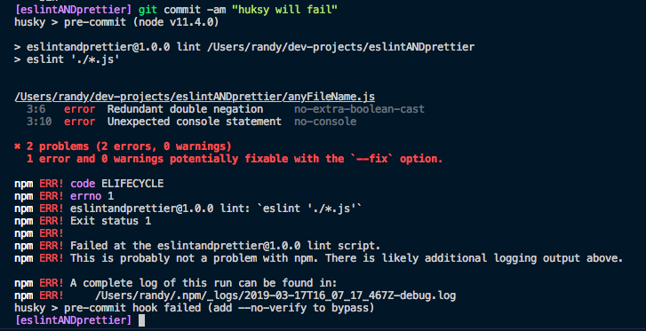
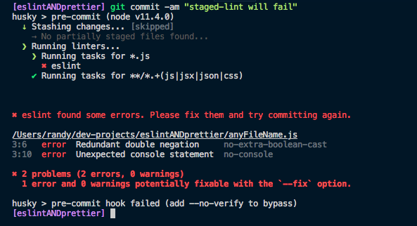

On the last blog post, we explored two of the most prominent code quality tools in JavaScript land: [ESLint](https://eslint.org/) and [Prettier](https://prettier.io/). Let's build on that knowledge and make them even more useful for our cause. If you are not familiar with these tools, I recommend that you read that [post](https://randyperez.tech/blog/prettier-eslint).

Picture this: You are about to finish a new feature that the product owner has been waiting for weeks. You do one last inspection then commit and push your changes to Git to start the review process. But it turns out that you forgot to run Eslint on one file, which is missing a semicolon, prompting one of your co-workers or the continuous integration pipeline to fail the review. It's a quick but very annoying fix that all programmers that I know hate.

Our goal in this post is to prevent situations like that by including an automated script that executes EsLint and Prettier before each commit, also known as **pre-commit hooks.** Let's explore what hooks are and how to set them up in our project.

## Git Hooks

Generally speaking, hooks are nothing but scripts that run when a specific action happens; In the context of git those actions can be `committing`, `pushing`, `rebasing` and more. **Bash** is a common choice for writing hooks but, any language like `Python` or `Go` should do. For example, hooks can run our entire test suite before a commit but, if they fail, prevent git from actually creating the commit.

There are tools that facilitate adding hooks to any project. In the JavaScript ecosystem, **Husky** is one of the leading players and, in my opinion, the easiest way to jump into the world of hooks.

For more on git hooks, check the [docs](https://git-scm.com/book/en/v2/Customizing-Git-Git-Hooks).

## Husky

[Husky's](https://www.npmjs.com/package/husky) maintainers describe it with just four words: "Git hooks made easy". Let's see if their claim holds up by installing it and setting up our first hook.

```bash
# installing as a regular npm package.
$ npm install husky --save-dev
```

As we can see, installation follows the standard procedure of NPM packages. With husky installed, we are ready to roll our first hook; let's make it run ESLint before each commit.

```json
// package.json
{
  "husky": {
    "hooks": {
      "pre-commit": "npm lint"
    }
  }
}
```

That's it! Three lines and our hook is running. The first thing we need is a top-level `husky` section in our `package.json` followed by a `hooks` objects where, as its name suggests, we describe all of our hooks. For each entry, we need to provide the hook's name and the command to run; for multiple commands use `&&` to separate them. In our case, we are telling husky to execute `npm lint` before commits(the `pre-commit` section).

For more examples and other supported hooks, see the [docs](https://github.com/typicode/husky/blob/master/DOCS.md).

### Husky in Action

To have a taste of what husky can do, let's commit some code that fails our linting rules.

```javascript
// Bad boy 🐶
var x = 1;
if (!!x) console.log('hi');
```

Trying to commit that code will result in an output like this:



The `pre-commit` hook runs ESLint, which fails, preventing our commit from materializing. We can bypass this check and commit failing code by adding the `--no-verify` flag to our commit command.

```bash
$ git commit -am "don't lint" --no-verify
```

Husky is shielding our code against un-linted code; this is all we need for small to medium-sized projects. However, we are linting our entire codebase before commits, which can take minutes in a large project. Unchanged files should not cause our commits to fail. Let's fix that.

## Lint-Staged

[Lint-staged](https://github.com/okonet/lint-staged) enables us to lint just the files that are part of a commit, saving time and making the results relevant in the current context. It plays well with husky since it relies on git hooks. Let's install and configure it.

```bash
# installing as a regular npm package.
$ npm install lint-staged --save-dev
```

```json
// package.json
{
  "husky": {
    "hooks": {
      "pre-commit": "lint-staged"
    }
  },
  "lint-staged": {
    "linters": {
      "*.js": ["eslint"],
      "**/*.+(js|jsx|json|css)": ["prettier --write", "git add"]
    }
  }
}
```

As you can see we did several things to our `package.json`, we'll go through each one of them:

1. Our husky pre-commit now executes the `lint-staged` command.
2. We added a `lint-staged` top-level object that contains a `linters` property.
3. `linters` is an object of linting tools that we want to run. We'll use ESLint and prettier but, it supports [much more](https://github.com/okonet/lint-staged).
4. Each property of linters is a regular expression that matches the files to lint and an array of commands to execute against them.
5. We want use `ESLint` on all the files that end in **.js**.
6. Finally, We want to format all the files that end in **.js**, **.jsx**, **.json**, and, **.css** using prettier and re-add them to the commit.

### Lint-Staged in Action



We are trying to commit the same we had in the Husky section and as you can see the results are similar. The main difference is the list of tasks staged-lint is running on our modified files.

## Conclusion

That's it! The entire process we described in the previous blog post in now automated using git hooks. The tooling in the JavaScript community in 2019 is top-notch, making our lives as developers so much easier. Even if it requires a bit of setup, these tools will save us a bunch of time in the long run. I'm a big fan!
