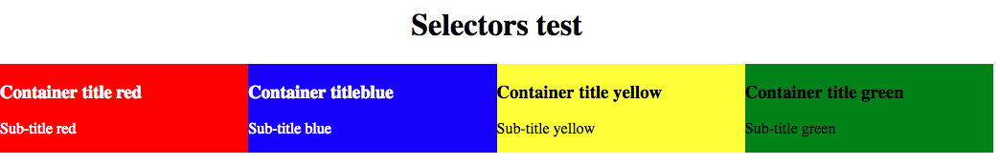

Nowadays whenever I need to grab an HTML element from the [DOM](https://developer.mozilla.org/en-US/docs/Web/API/Document_Object_Model), I reach for [querySelector](https://developer.mozilla.org/en-US/docs/Web/API/Document/querySelector) or [querySelectorAll](https://developer.mozilla.org/en-US/docs/Web/API/Document/querySelectorAll). They feel intuitive because we can use CSS syntax to select any node. However, there are other methods that serve a similar purpose, but I never use them; like [getElementById](https://developer.mozilla.org/en-US/docs/Web/API/Document/getElementById) and the [getElementsBy\*](https://developer.mozilla.org/en-US/docs/Web/API/Document#Methods) family.

In this post, I want to explore the features that I might be missing out for completely neglecting these methods or, at least, have a clear understanding of what advantages they provide.

## Sample Project

To play around with selectors, I'll be using a small HTML file with four divs and two elements of content inside each one. There's also a [CodePen](https://codepen.io/randyjp/pen/gqxyxQ).

```html
<body>
  <div class="container red">
    <h3>Container title red</h3>
    <span>
      <p>Sub-title red</p>
    </span>
  </div>
  <div class="container  blue">
      <h3 id="blue-title">Container title blue</h3>
      <span>
        <p>Sub-title blue</p>
      </span>
    </div>
  </div>
  <div class="container yellow">
      <h3>Container title yellow</h3>
      <span>
        <p>Sub-title yellow</p>
      </span>
    </div>
  </div>
  <div class="container green">
      <h3>Container title green</h3>
      <span>
        <p>Sub-title green</p>
      </span>
   </div>
</body>
```



## Selecting one element

Let's start with `getElementById()`, which has been around for years. It takes a string as its only parameter and returns the HTML [element](https://developer.mozilla.org/en-US/docs/Web/API/Element) that has a matching ID. Valid HTML requires unique IDs in every document thus we are expecting not more than one match.

```javascript
const blueTitle = document.getElementById('blue-title');
console.log(blueTitle); // <h3 id="blue-title">Container title blue</h3>
```

When selecting elements that don't necessarily have an ID attribute we can use `querySelector()`. It takes a string with one or more valid CSS selectors as an argument and returns the FIRST element that matches that criteria. Multiple elements can share the same selector, that's why querySelector will return when it finds a match on the DOM tree.

```javascript
// Any valid CSS selector and that includes IDs
const blueTitle = document.querySelector('#blue-title'); // <h3 id="blue-title">Container title blue</h3>
// there's 4 h3 tags in the document but red is the first one.
const redTitle = document.querySelector('h3'); //<h3>Container title red</h3>
// Can use multiple selectors.
const greenSub = document.querySelector('.green span p'); // <p>Sub-title green</p>
```

### Performance

In our scenario, getElementById runs at speed of 29.9 million Ops/sec(Operations per second) and querySelector at 10.8 million Ops/sec. No doubt there's a clear winner, but they are both blazing fast. Unless I was remarkably concerned about performance, I plan to continue using querySelector.

Source: [jsperf](https://jsperf.com/js-selector-rjp).

## Selecting multiple elements

Here the landscape becomes a little bit more complicated; there are several methods with similar implementations that can get the job done. We are going to explore three of those: `getElementsByClassName()`, `getElementsByTagName()` and `querySelectorAll()`. But before we jump into it, let's make a pit stop in two key concepts that will come up while applying these methods.

### Static Vs Live collections

A live collection is a 1-1 representation of the DOM and, any changes to it also affect the collection. For instance, after querying the DOM we have a list that contains 4 elements, then our DOM changes to accommodate one more; the live collection will update to reflect the new state of the DOM and now contains 5 elements.

On the other hand, static lists won't be updated to reflect the current state of the DOM. You can think of it like having a clone(static) or a reference(live) of the DOM.

### HTMLCollection VS NodeList

An [HTMLCollection](https://developer.mozilla.org/en-US/docs/Web/API/HTMLCollection#Methods) is an array-like data structure that holds elements. They are live collections and provide methods to grab things from the list. Similarly, a [NodeList](https://developer.mozilla.org/en-US/docs/Web/API/NodeList) is an array-like collection of Nodes that can be live or static and has methods to iterate over the list.

Confusing? Sounds like the same thing? You are not alone! The main difference is that a NodeList holds nodes and an HTMLCollection just elements. [Node](https://developer.mozilla.org/en-US/docs/Glossary/Node/DOM) is an umbrella term for any object that lives in the DOM like comments, text, HTML tags... While [elements](https://dom.spec.whatwg.org/#concept-element) are just a specific kind of nodes, for example, the h1 and body tags are elements.

### Methods

Let's try **getElementsByClassName** first, as its names suggest it takes a class name and returns an HTMLCollection of elements that have that class. Remember this is a live collection thus any changes to it will reflect on the DOM.

```javascript
// getElementsByClassName
const containers = document.getElementsByClassName('container');
// Selecting the first element.
console.log(containers[0]);
// IT's ALIVEEE!!
console.log(containers); // HTMLCollection(4) [div.container.red, ...]
// Edit the DOM.
const body = document.querySelector('body');
body.appendChild(greenContainer.cloneNode());
console.log(containers); // HTMLCollection(5) [div.container.red, ...]
// to Iterate
Array.from(containers).map(elem => console.log(elem));
// clean up
body.removeChild(body.lastChild);
```

Another, almost identical method, is **getElementsByTagName**; the only difference is that it expects an HTML tag name instead of class and returns a list of elements that match that tag.

```javascript
// getElementsByTagName
const containersTag = document.getElementsByTagName('div'); // Live collection.
// Selecting the second element.
console.log(containersTag[1]);
// edit an element's text content.
containersTag[1].textContent = 'hi';
// to Iterate
Array.from(containersTag).map(elem => console.log(e
```

Last but not least is **querySelectorAll**, It expects a string with one or more valid CSS selectors, just like its sibling querySelector, but it returns a static NodeList of all the nodes that match. Keep in mind, changes to the collection won't affect the DOM.

```javascript
// querySelectorAll
const containersQuery = document.querySelectorAll('.container');
console.log(containersQuery);
// Selecting the third node.
console.log(containersQuery[2]);
// edit an element's text content.
containersQuery.item(2).textContent = 'hi';
// He's dead JIM!!!
console.log(containersQuery); // NodeList(4) [div.container.red, ...]
// Edit the DOM.
body.appendChild(greenContainer.cloneNode());
console.log(containersQuery); // // NodeList(4) [div.container.red, ...]
// to Iterate
containersQuery.forEach(elem => console.log(elem));
// Or if you want array methods.
Array.from(containersQuery).map(elem => console.log(elem));
```

### Performance

querySelectorAll has the worst performance clocking at **188,830 Ops/sec;** while getElementsByTagName and getElementsByClassName are around the **23 million Ops/sec**. It's clear that getElementsBy\* is the clear winner when performance is our major concern.

Source: [jsperf](https://jsperf.com/js-selector-rjp).

## Conclusion

I still love how versatile querySelector and querySelectorAll are; also working with static lists provides the peace of knowing what's in it at all times. Nevertheless, now I have better tools to make an informed decision and, I'll be reaching out for other JavaScript selectors more often.
