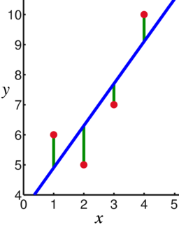
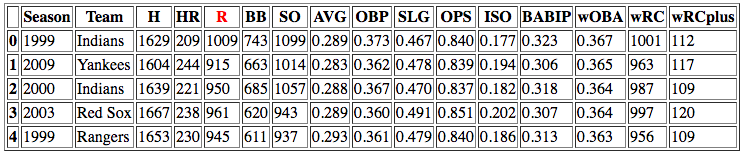
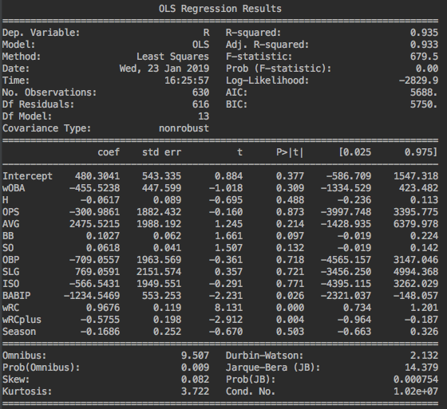
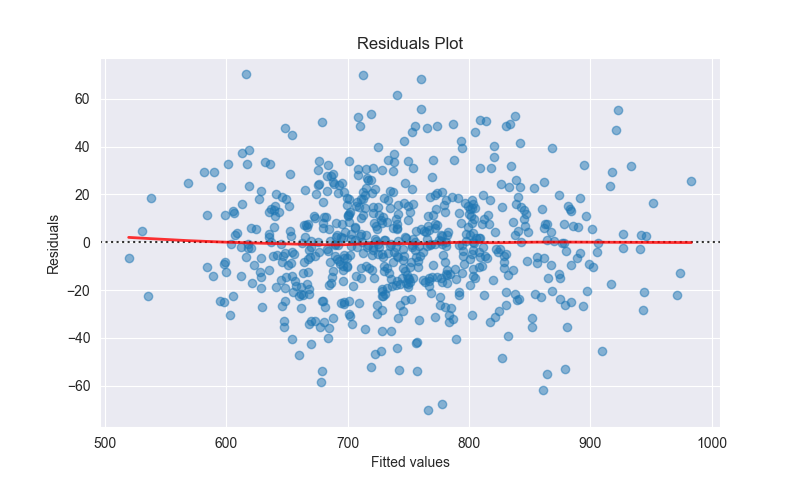
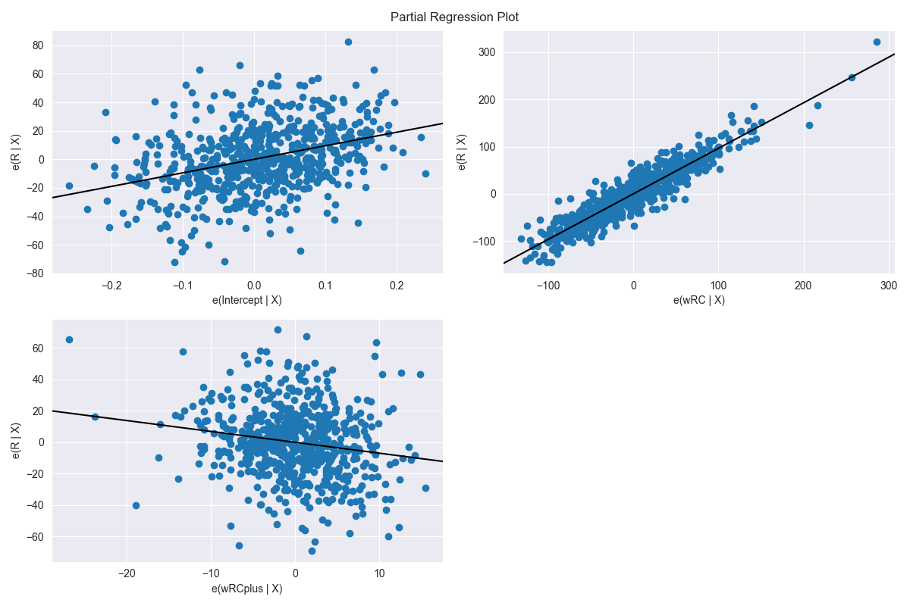

In this post, we'll be going over the steps for building **Linear Regression** models using **Python 3**. They are popular models in machine learning and usually, one of the firsts we'll encounter in statistics textbooks and classes. It's a powerful tool that produces quick and interpretable predictions.

To demonstrate how to build and evaluate models we'll be answering the following question: "What is the most accurate metric to describe offensive production in [baseball](https://www.youtube.com/watch?v=skOsApsF0jQ)?". If you are not familiar with the sport, offense(batting) is all about scoring "points" which are called **runs**. We are going to use a dataset from [FanGraphs](https://www.fangraphs.com/) that contains the run-scoring metrics from the 30 [MLB](https://www.mlb.com/) teams during the last 20 years.

In other words, we'll find out how to predict runs using python and linear regression models.

##Linear Regression

It's a statistical method that aims to express the linear relationship between predictors or independent variables(X) and the response or dependent variable(y). We do this by "fitting" a straight line that minimizes the error between predicted and actual values.



To make the concept a bit more clear, let's describe it using the graph above. The red dots are the actual points that we want to predict, in blue and containing our predicted values is the regression line, and the green line is the difference between the predicted and actual data points also known as error.

If you want to expand on this topic Khan Academy has an excellent [video tutorial](https://www.khanacademy.org/math/statistics-probability/describing-relationships-quantitative-data#introduction-to-trend-lines) or, there's plenty of online resources like [this](https://en.wikipedia.org/wiki/Linear_regression).

##The Tool Box

It's time to jump into Python land. To achieve our goal, we'll be using some packages that are going to make the experience smoother. Descriptions are mostly taken for the librarie's website.

- [Statsmodels](https://www.statsmodels.org): The star of our show. Contains all the necessary methods to spin up a linear regression and several other statistical models.
- [Pandas](https://pandas.pydata.org): Library providing high-performance, easy-to-use data structures, and data analysis tools. We'll use it to import our data into Python.
- [Matplotlib](https://matplotlib.org/): Is a Python 2D plotting library which produces publication quality figures in a variety of hardcopy formats and interactive environments across platforms.
- [Seaborn](https://seaborn.pydata.org/): Provides several high-level methods to draw attractive and informative statistical graphics. Based on Matplotlib.
- [Patsy](https://patsy.readthedocs.io): Is a Python package for describing statistical models (especially linear models, or models that have a linear component) and building design matrices.

## Importing data into Python

Datasets come in many flavors but, by far, the most common are CVS(Comma Separated Values) files. Python comes with a native library to read and works with CSV files; but in reality, Pandas has become the go-to for dealing with this kind of task. That's because it helps to work with large datasets and it's packed with handy methods that facilitate statistical analysis.

Importing our file using pandas requires just one method call with our desired file path. Let's also be safe and check that our file exists before opening it. The function returns a Pandas [DataFrame](https://pandas.pydata.org/pandas-docs/version/0.23.4/generated/pandas.DataFrame.html).

```python
import os
import pandas as pd

def read_csv_file(path):
    if not os.path.exists(path):
        raise FileNotFoundError("The file you are trying to access does not exist")
    # header=0 -> first row contains columns name and not actual data.
    return pd.read_csv(path, header=0, )


batting = read_csv_file(DATA_PATH)
```

##Data exploration

We already have a very clean dataset with no missing values or variables that require pre-processing so let's take a look at it.



There are 15 columns and 630 rows in the table. In red we have **Runs(R)** which is our dependent variable, and the remaining are our predictors to estimate runs. We won't go over what all those numbers mean but if you are interested **Fangraphs** has the [answer](https://library.fangraphs.com/offense/offensive-statistics-list/).

If I had pick which predictor is best suited to infer the number of runs, I would put my money on **wOBA** but let's see what Linear Regression has to say about that.

## Writing formulas in code

We are done importing our data and have a DataFrame waiting for us in memory. But how does Python knows which is our dependent variable and the predictors? It has no clue! We can point to the appropriate columns by using a Pasty formula.

```python
from patsy import dmatrices

offense_formula = 'R ~ wOBA + H + OPS  + AVG + BB  + SO + OBP + SLG + ' \
                  'ISO + BABIP + wRC + wRCplus + Season'
# Let pasty know which is out dataset and that we want a pandas DataFrame back.
y, X = dmatrices(formula, data=batting, return_type='dataframe')
```

As we can see, expressing a formula with pasty is done using strings plus the [dmatrices](https://patsy.readthedocs.io/en/latest/overview.html) function. The first part is the dependent variable(y), and everything after the "~" are independent variables(X). We are using columns' names to compose the formula.

##Fitting the Model

In plain terms, a model is just a description of reality, in our case baseball data, commonly represented using a formula similar to the one in our previous section. Since we are using a linear model, more specifically [least squares](https://en.wikipedia.org/wiki/Least_squares), **"fitting"** means finding the straight line that folows our data distribution as closely as possible.

**Statsmodels** provides an API that encapsulates all the complicated math involved in the fitting process and returns an object with the resulting model.

```python
import statsmodels.api as sm
from patsy import dmatrices

def get_fitted_ols_model(formula, data):
    y, X = dmatrices(formula, data=data, return_type='dataframe')
    # OLS = ordinary least squares. Pass our dependent and independent variable as parameters.
    ols_model = sm.OLS(y, X)
    return ols_model.fit()

offense_model = get_fitted_ols_model(offense_formula, batting)
```

We are done fitting the model. Now, there is a handy summary function that prints all sorts of statistics about our model.

```python
print(offense_model.summary())
```



##Wait? What? What do I do with all that?

We ended up with a lengthy list of fancy terms and number but are we done? What's the meaning of all that? We can't possibly go through each value, but there are two key points we need to drive home:

###1.Which predictors are important?

We can determine importance by inspecting the **P-values(P>|t|)** column. It shows if our predictor had an "effect" on the observed value. For example, if a difference in the number of hits doesn't alter the number of runs, then the predictor is not significant in our model.
That last part is critical, variables might be relevant in isolation, but other predictors could already being considering its effect.

The most common convention states that P-values smaller than **0.05** denote importance. Thus, in our model, two predictors have a significant effect on runs: **wRC** and **wRCplus**. Thus, looking at the summary, we can remove most variables and still keep the same predictive power.

```python
offense_formula = 'R ~ wRC + wRCplus'
```

To expand on P-values: [Blog Post](http://blog.minitab.com/blog/adventures-in-statistics-2/how-to-correctly-interpret-p-values) and [Video](https://www.youtube.com/watch?v=KS6KEWaoOOE).

###2) Is this a good model?

Moving on, we need a way to tell if our model is a sound representation of reality. There's plenty of ways to test for this, but we are focusing on two methods: Adjusted R-Squared and Partial Regression plots.

####2.1) R^2

The [coefficient of determination](http://blog.minitab.com/blog/adventures-in-statistics-2/regression-analysis-how-do-i-interpret-r-squared-and-assess-the-goodness-of-fit) or **R-squared** represents the percentage of variation of the response variable that's explained by a model. We got an R^2 of 0.933(in the summary table), which means that our model can explain 93.3% of the change in runs. Not bad!!

####2.2) Residuals Plot

[Residuals](https://stattrek.com/statistics/dictionary.aspx?definition=residual) are the difference between predicted and real values.The idea behind it is that we shouldn't be able to predict the error on our forecasts since errors are random. A good plot is evenly distributed and with no discerning patterns. Let's build a residuals plot:

```python
import matplotlib.pyplot as plt
import seaborn as sns

def get_residuals_plot_ols(data, fitted_model, y_name, figure_height, figure_width, save_to_file=False,
                           file_name="residuals_plot"):
    # get the predicted values from the model
    fitted_values = fitted_model.fittedvalues

    # define some graphs styles
    resid_plot = plt.figure(1)
    resid_plot.set_figwidth(figure_height)
    resid_plot.set_figwidth(figure_width)
    sns.set_style('darkgrid')
    # tell seaborn to generate a residuals plot
    resid_plot.axes[0] = sns.residplot(fitted_values, y_name, data=data,
                                       lowess=True,
                                       scatter_kws={'alpha': 0.5},
                                       line_kws={'color': 'red', 'lw': 2, 'alpha': 0.8})

    # add labels.
    resid_plot.axes[0].set_title('Residuals Plot')
    resid_plot.axes[0].set_xlabel('Fitted values')
    resid_plot.axes[0].set_ylabel('Residuals')

    if save_to_file:
        resid_plot.savefig(file_name + ".png")

    return resid_plot

# create the graph using our new formula.
new_offense_formula = 'R ~ wRC + wRCplus'
new_offense_model = get_fitted_ols_model(new_offense_formula, batting)
res_plot = get_residuals_plot_ols(batting, new_offense_model, 'R', 6, 8, save_to_file=True)
plt.show()
```



As far as we can tell the points look randomly distributed which shows that this linear model is a good fit for our data. For more on this topic, Khan Academy has a [great video](https://www.khanacademy.org/math/ap-statistics/bivariate-data-ap/assessing-fit-least-squares-regression/v/residual-plots).

##Answering the Question.

We ended up with two variables(wRC and wRC+) that can account for 93% of run production, yet our question demands only one winner. For the final battle, we are going to plot our predictors VS runs and fit our regression line through the data points; giving us a clear picture of which one better describes our data. We refer to this as a partial regression plot.

```python
def get_partial_regression_plot(fitted_model, figure_size=(12, 8), save_to_file=False, file_name="regression_plot"):
	# This will also include the intercept.
    reg_plot = sm.graphics.plot_partregress_grid(fitted_model, fig=plt.figure(figsize=figure_size))

    if save_to_file:
        reg_plot.savefig(file_name + ".png")

    return reg_plot

reg_plot = get_partial_regression_plot(new_offense_model, save_to_file=True)
plt.show()
```



**wRC** is the uncontested winner here. We have almost a perfect regression line; that's a clear sign that we found an accurate predictor for runs.

##Conclusion and Future Work

In conclusion, if we want to understand how good a team was, in offensive terms, we should look at wRC. I was surprised to see it take the throne instead of wOBA. After further inspection, I found that wOBA is a significant part of the wRC formula. Now we have the tools to explore other aspects of the game like defense or pitching metrics. We could also explore more linear or non-linear models that might be a better fit for our data.

Hopefully, this was a useful introduction to linear models in Python. Ordinary least squares(OLS) is a simple yet powerful model with several Python packages that implement it.

Here's a link to the [code](https://github.com/Randyjp/python-linear-reg).
