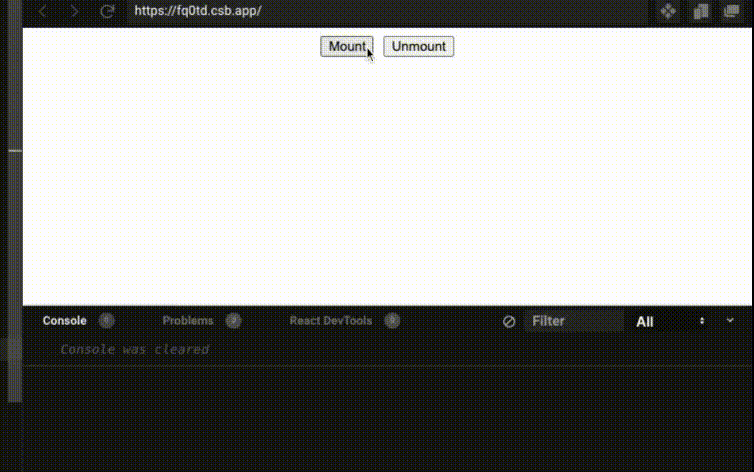
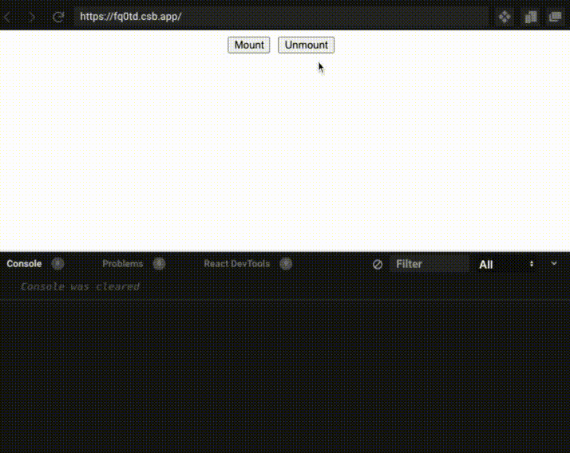
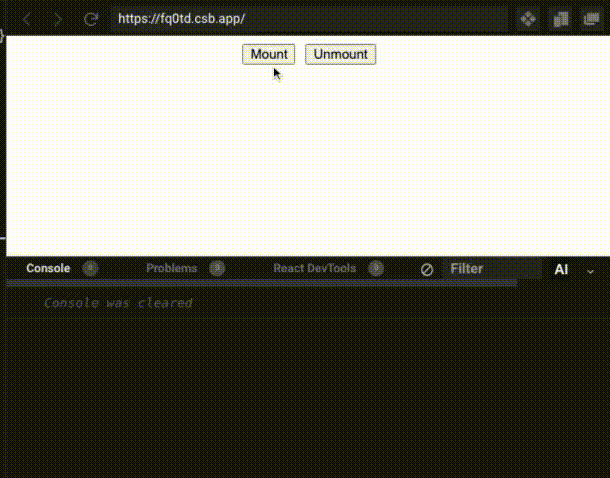

### The Problem

I've seen this quite a few times: user get to a page, that page has a component that triggers an asynchronous API call, the user leaves before that call resolves, the API returns, and React tries to update the state.. of a component that doesn't exist anymore.

Here's a little app(it's contrived, I know) to help us visualize the issue. When the user clicks on **mount**, we'll make an HTTP call to retrieve a random profile that renders on the screen. If we click on **unmount**, we remove the User component from the screen. Nothing exciting here!



```javascript
import { useState, useEffect, Fragment } from 'react';

function User() {
  const [user, setUser] = useState();

  useEffect(() => {
    window
      .fetch(`https://randomuser.me/api/`)
      .then((res) => res.json())
      .then((data) => {
        setUser(data.results[0]);
      });
  }, []);

  return (
    <div style={{ marginBottom: '15px' }}>
      {Boolean(user) && (
        <Fragment>
          
          <div>{`Name: ${user.name.first} ${user.name.last}`}</div>
          <div>{`E-mail: ${user.email}`}</div>
        </Fragment>
      )}
    </div>
  );
}

export default function App() {
  const [shouldDisplayUser, setShouldDisplayUser] = useState(false);
  return (
    <div className="App">
      {shouldDisplayUser && <User />}
      <button
        style={{ marginRight: '10px' }}
        onClick={() => setShouldDisplayUser(true)}
      >
        Mount
      </button>
      <button onClick={() => setShouldDisplayUser(false)}>Unmount</button>
    </div>
  );
}
```

Now, let's see what happens when we unmount the User component before the promise resolves.



> **Tip**: If you are on a fast and stable connection, you'll have a hard time reproducing these issues. I recommend that you [throttle your internet speed](https://developers.google.com/web/tools/chrome-devtools/network#throttle) using Chrome's network tab. I'm using "slow 3G".

Here's what the error says: **Warning: Can't perform a React state update on an unmounted component. This is a no-op, but it indicates a memory leak in your application. To fix, cancel all subscriptions and asynchronous tasks in a useEffect cleanup function. at User (https://fq0td.csb.app/src/App.js:27:39)**

Props to the React team; the error message is spot on. Let's put into even more mundane terms for our specific use case: "You are trying to update the state of a non-existent component. There's nothing to update".

### How do we fix it?

Ideally, we should cancel the promise, but at the time of writing, promises are [uncancellable](https://stackoverflow.com/questions/29478751/cancel-a-vanilla-ecmascript-6-promise-chain) in JavaScript; we need a plan B. How about if we check that the component is mounted before updating state? That sounds promising.

The standard solution for checking that a component is mounted involves using the `useEffect` and `useRef` hooks together. In summary, we create an empty ref that will be set to **TRUE** when the component mounts and to **FALSE** when it unmounts. We rely on `useEffect` to know when mounting/unmounting occurs. Finally, we need to check the value of the ref before setting the state, like this:

```javascript
...
function User() {
  const [user, setUser] = useState();
  // highlight-start
  const isMounted = useRef();

  useEffect(() => {
    if (!isMounted.current) {
      isMounted.current = true;
    }

    return () => (isMounted.current = false);
  }, []);
  // highlight-end

  useEffect(() => {
    window
      .fetch(`https://randomuser.me/api/`)
      .then((res) => res.json())
      .then((data) => {
	     // highlight-start
        if (isMounted.current) {
          setUser(data.results[0]);
        }
        // highlight-end
        console.log("promise resolved");
      });
  }, []);
...
}
...
```

That's it! We are now making sure that the component is on the screen before updating the state.



> **Tip**: you could extract the isMounted logic into a [custom hook](https://gist.github.com/jaydenseric/a67cfb1b809b1b789daa17dfe6f83daa)
