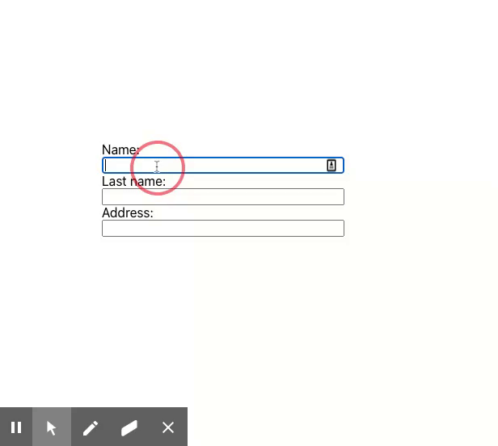
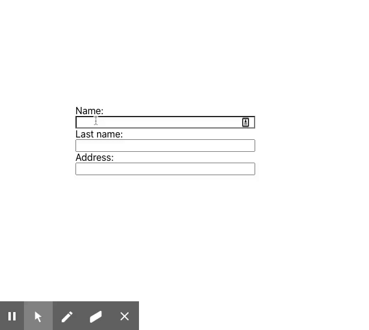

A few days ago, I was working with a form component when I ran into a "small" bug where one of my text fields would lose focus when the user typed in it. Here's how it looked:



That user experience sucks! My initial estimate was 10-20 minutes to fix it but, it turns out, I didn't understand functional components as well as I thought. Let's take a look at an example that illustrates the problem in more detail- it is a bit contrived -.

**Note: The address field is the culprit.**

```javascript
import React from 'react';

function MyAwesomeForm() {
  const [state, setState] = React.useState({
    nameInput: '',
    lastNameInput: '',
    addressInput: '',
  });

  function handleInputChange(event) {
    const target = event.target;
    const value = target.type === 'checkbox' ? target.checked : target.value;
    const name = target.name;

    setState({
      ...state,
      [name]: value,
    });
  }

  function AddressField() {
    return (
      <React.Fragment>
        <label htmlFor="addressInput">Address:</label>
        <input
          name="addressInput"
          type="text"
          value={state.addressInput}
          onChange={handleInputChange}
        />
      </React.Fragment>
    );
  }

  return (
    <div
      style={{
        height: '100vh',
        width: '100vh',
        display: 'flex',
        justifyContent: 'center',
        alignItems: 'center',
      }}
    >
      <form
        style={{
          display: 'flex',
          flexDirection: 'column',
          height: '200px',
          width: '300px',
        }}
      >
        <label htmlFor="nameInput">Name:</label>
        <input
          name="nameInput"
          type="text"
          value={state.nameInput}
          onChange={handleInputChange}
        />
        <label htmlFor="lastNameInput">Last name:</label>
        <input
          name="lastNameInput"
          type="text"
          value={state.lastNameInput}
          onChange={handleInputChange}
        />
        <AddressField />
      </form>
    </div>
  );
}
```

On the surface, it looks like good code, but why do we keep losing focus? Let's take a step back, what should happen(ideally) when we type into the address field?

1. The `onChange` handler gets called
2. Our state gets updated with the new value
3. There's a change in the sate, our component will re-render

Number three is where our problem is happening. You see, **functional components don't have a render method; their entire body is equivalent to a class component's render method. React will execute everything within a functional component's body on each render**. Can you spot the problem? We are recreating the `AddressField` on each render! It's a completely new component so React has no way of knowing that it should place the focus on the newly created component. Even worse, as you can imagine, this is also really inefficient.

How can squash this annoying bug? There are a few things we can do, one of them is to move `AddressField` outside `MyAwesomeForm`'s body:

**Alternate solution:** Get rid `AddressField` component and put everything in `MyAwesomeForm`.

```javascript
import React from 'react';

function AddressField({ addressInput, handleInputChange }) {
  return (
    <React.Fragment>
      <label htmlFor="addressInput">Address:</label>
      <input
        name="addressInput"
        type="text"
        value={addressInput}
        onChange={handleInputChange}
      />
    </React.Fragment>
  );
}

function MyAwesomeForm() {
  const [state, setState] = React.useState({
    nameInput: '',
    lastNameInput: '',
    addressInput: '',
  });

  function handleInputChange(event) {
    const target = event.target;
    const value = target.type === 'checkbox' ? target.checked : target.value;
    const name = target.name;

    setState({
      ...state,
      [name]: value,
    });
  }

  return (
    <div
      style={{
        height: '100vh',
        width: '100vh',
        display: 'flex',
        justifyContent: 'center',
        alignItems: 'center',
      }}
    >
      <form
        style={{
          display: 'flex',
          flexDirection: 'column',
          height: '200px',
          width: '300px',
        }}
      >
        <label htmlFor="nameInput">Name:</label>
        <input
          name="nameInput"
          type="text"
          value={state.nameInput}
          onChange={handleInputChange}
        />
        <label htmlFor="lastNameInput">Last name:</label>
        <input
          name="lastNameInput"
          type="text"
          value={state.lastNameInput}
          onChange={handleInputChange}
        />
        <AddressField
          addressInput={state.addressInput}
          handleInputChange={handleInputChange}
        />
      </form>
    </div>
  );
}
```



## Conclusion

Avoid writing React components inside other components. There are so many things that can go wrong with this approach and no obvious benefits! Remember, **everything within the body of a functional component will have a new identity on each render.**
