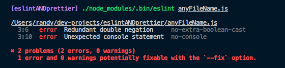

When I started playing with modern JavaScript, I quickly stumble into colleagues and video tutorials with text editors that highlighted syntax errors and magically formatted their code every time they saved. I was jealous; I wanted that immediately! After a few questions and a quick google search, it was clear I had to install [ESLint](https://eslint.org/) and [Prettier](https://prettier.io/).

I got this! It's just a quick `npm install eslint prettier` and, my code is going to look like Dennis Ritchie wrote it. Guess what? Nothing happened! Just that I found myself filled with questions that seem make no sense. Global or local install? Configuration files? Are Prettier and ESLint fighting each other? Why VSCode does nothing? Let's try to answer that and a few more questions by going through the steps I follow to set up these tools.

## Linting VS Formatting

I was widely confused in this particular aspect; I couldn't tell if things were coming from ESLint or Prettier. Yeah sure, one "lints" and the other one "formats" my code but, isn't that the same thing? Not quite even if feel like doing the same from time to time.

**Linting** is a type of static code analysis(not compiled or interpreted by the browser) that aims to find common errors as soon as they happen. For instance, let's say we are using a variable before it was declared or that we have a double equal sign(==) in our code when we want to use strict equality(===), then our linter will complain. Much better than letting the testers or end users catch it. It's worth noting that linters can also warn us about some style violations, like max number of characters in a line of code.

Formatting is strictly concerned about how the code looks. It allows developers to set code style conventions and let the tool handle any violation. A formatting tool can fix things like semi-colons, bracket location, dangling commas and several more. is strictly concerned about how the code looks. It allows developers to set code style conventions and let the tool handle any violation. A formatting tool can fix things like semi-colons, bracket location, dangling commas and several more.

There is an overlap between formatting and linting; an improper configuration can lead to conflicting rules between the tools. In short, linting is concerned about code quality and some style rules while formatting is all about the style of our code.

Let's go ever the specific tools that JavaScript developers tend to use for these tasks.

## ESLint

According to ESLint's website: "Is a tool for identifying and reporting on patterns found in ECMAScript/JavaScript code, with the goal of making the code more consistent and avoiding bugs".

### Installation

You can install ESLint as part of a single project or as a global tool that runs across all of them. If there's a global and local instance available, the local take precedence. I tend to have it globally for quick prototypes and locally for long-term projects. This setup allows for a group of basic rules to be available everywhere and more specific rules to live on each project's directory. It has a one-step installation:

```bash
$ npm install -g eslint # global installation
$ npm install eslint --save-dev # local installation
```

### Configuration file

My favorite part of ESLint is that it comes pre-loaded with a great set of rules that can improve your code right out of the box with widely accepted best practices. That's just the tip of the iceberg since we can define our own set of rules or use one provided by third parties like [Google](https://google.github.io/styleguide/jsguide.html) and [Airbnb](https://github.com/airbnb/javascript).

All the configuration resides in the `.eslintrc` file. To include one in your project, run the init script, then you'll be prompted to answer a few questions that will help create the file.

```bash
$ ./node_modules/.bin/eslint --init  # for local installations
$ eslint --init # for global installations
```

Your configuration file might end up looking along these lines:

```json
{
  "env": {
    "browser": true
  },
  "extends": "eslint:recommended",
  "rules": {
    "default-case": "error"
  }
}
```

For more on how to configure ESLint and it's rules click [here](https://eslint.org/docs/user-guide/getting-started#configuration).

### Linting files

To "**lint**" your files you have to use the "**eslint**" command passing the file in question as an argument:

```javascript
// very complex code we want to check(anyFileName.js)
var x = 1;
if (!!x) console.log("hi");
```

```bash
$ ./node_modules/.bin/eslint anyFileName.js # for local installations
$  eslint anyFileName.js # for global installations
```

There will be no output if everything is alright, but if there's any violation our output will look similar to:



We get the name and location of the rule we are breaking. If we need more context to understand what ESLint is saying, they have a detailed [rules](https://eslint.org/docs/rules/) page on their website that provides just that. For example, I have a "[Redundant double negation](https://eslint.org/docs/rules/no-extra-boolean-cast)" on line #3.

### Fixing Errors

For the most part, ESLint will warn us when it encounters an error that we can manually fix. There are, however, some problems that our linter can auto-fix when we include the "--fix" flag. If you recall the previous section, we had one of those(the redundant double negation) so let's fix it:

```bash
$ ./node_modules/.bin/eslint anyFileName.js --fix # for local installations
$  eslint anyFileName.js --fix # for global installations
```

```javascript
// Fixed code.
var x = 1;
if (x) console.log("hi");
```

That's a convenient feature but, it won't fix most errors. To provide more comprehensive corrections, ESLint would have to make broad assumptions about our code while risking to introduce new errors. Or in other words, keep your expectations regarding this feature.

### Make it easy

Adding a script with our lint commands is a great way to improve how developers and automated systems interact with ESLint. Let's do that by including this in the scripts section of our `package.json`:

```json
  "scripts": {
    "lint": "eslint './*.js'",
    "lint:fix": "eslint './*.js' --fix"
  }
```

Note how we are passing a regular expression to the `eslint` command, this will grab all of our `.js` files in the root directory. Finally, to lint our files run:

```bash
$ npm run lint # just lint
$ npm run lint:fix  # lint and fix
```

Awesome! Right? But there's more. I love how ESLint integrates with text editors, like VSCode, to seamlessly run in the background while you type. There are extensions for all the major players like [VSCode](https://marketplace.visualstudio.com/items?itemName=dbaeumer.vscode-eslint), [Sublime](SublimeLinter), and [Atom](https://atom.io/packages/linter-eslint). After installation, your editor will highlight rule violations, now you never have to type that command again(I WISH).

## Prettier

Prettier's website describes it as an opinionated code formatter and, I can tell you that it is. It strips code of all the original styles and reprints it following its configuration. Since Prettier rewrites our code, it can safely remove any undesired format which guarantees consistent styles across the project.

### Installing

Just like ESLint, we can have a global or local installation:

```bash
$ npm install prettier --save-dev # local
$ npm install -g prettier # globally
```

## Configuration

Remember the opinionated part? That means Prettier makes several stylistic decisions that we can't configure. What they are trying to accomplish is shortening discussions about styles that lead nowhere in terms of productivity or shipped features. Nevertheless, there are a few options that we can change using the command line or the `.prettierrc` configuration file. Let's override a few of the defaults:

```json
// note: This is a JSON file so comments should be removed. (.prettierrc)
{
  "trailingComma": "es5", // add a trailing command if still valid es5 code
  "tabWidth": 3, // tab will be = 3 spaces. </3
  "semi": false, // no semi colons
  "singleQuote": true // always use single quotes
}
```

### Time To Look Pretty

We can format our files using the command line tool; there are several flags available that modify the default behavior. Here are a few of the most common use cases:

```bash
# To use local installation replace "prettier" for "./node_modules/.bin/prettier"
$ prettier anyFileName.js # Prints formatted file in the console
$ prettier --check anyFileName.js # Checks if file is formatted properly
$ prettier --write anyFileName.js # Formats the file if necessary
```

### Make it easy

Running that command all the time can become a pain, thus we want our editor to do the heavy lifting. There are two possible, not mutually exclusive, options: allowing our editor to format files each time it saves and running prettier on pre-commit hooks(which I'll cover in a future blog post).

To integrate Prettier into our text editor, we'll need to install the proper plugin. We'll cover VSCode but, there are options available for most editors like [VIM](https://github.com/prettier/vim-prettier), [Atom](https://atom.io/packages/prettier-atom), and [Sublime](https://github.com/jonlabelle/SublimeJsPrettier).

First, let's open VSCode and install the [Prettier extension](https://marketplace.visualstudio.com/items?itemName=esbenp.prettier-vscode) from the marketplace. Finally, we need to set our editor to format files on each save by including this in the settings:

```json
{
  // Turns off formatOnSave. Just to be safe.
  "editor.formatOnSave": false,
  // Enable per-language
  "[javascript]": {
    "editor.formatOnSave": true
  }
}
```

And that's it! Code will format files using Prettier every time we hit save.

## Working Together: ESLint + Prettier

When ESLint and Prettier are active in the same project, they could have potentially conflicting rules. This situation causes a major headache, in the sense that Prettier will format our code in a way that ESLint classifies as having errors. For example, Prettier removes semi-colons after each save but, that produces an error with our current lint configuration. We want to avoid that doomsday scenario.

This is where [eslint-config-prettier](https://github.com/prettier/eslint-config-prettier) comes into play. It works by turning off all the ESLint rules that prettier is already taking care of or in other words, why lint it if Prettier will fix it? Let's install it:

```bash
# In the command line
$ npm install --save-dev eslint-config-prettier
```

```json
// Add prettier to our .eslintrc.json file
{
  "env": {
    "browser": true
  },
  "extends": ["eslint:recommended", "prettier"],
  "rules": {
    "default-case": "error"
  }
}
```

That's it! They are friends now! If you want to explore the extra options that this plugin offers, check their [documentation](https://github.com/prettier/eslint-config-prettier#special-rules).

## Conclusion and Future Work

Now we have a working installation of ESLint and Prettier which is a vital step towards improving any JavaScript workflow. They save time and prevent countless errors which makes the programer's life easier.

In the second part of this post, we'll explore using git hooks to incorporate linting and formatting to avoid committing untreated code to our repository. Stay tuned!
