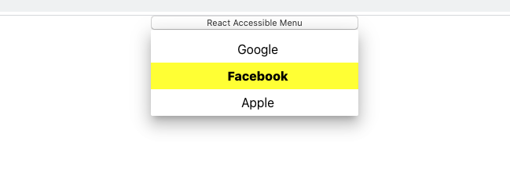

React, and other JavaScripts libraries, are infamous for how little they do in the accessibility department. Given that an accessible framework is not a "flashy" feature that will catch all the headlines, like [concurrent mode](https://reactjs.org/docs/concurrent-mode-intro.html), it is easy to treat it as an afterthought. However, it will be disingenuous to blame it entirely on React when we can easily make our interfaces accessible with a few minor tweaks.

In this post, I want to take a stab at building a common piece of UI while being mindful of accessibility. We'll create a **Navigation Menu Button** heavily inspired by this [example](https://www.w3.org/TR/wai-aria-practices/examples/menu-button/menu-button-links.html). Side-note, check the [w3.org](https://www.w3.org/TR/wai-aria-practices/) site for polishing your accessibility skills.



## Requirements and Defining scope

A few notes before we start:

1. Should be easy to operate with the keyboard
2. Good visual contrast
3. Friendly for screen readers
4. Responds to mouse click events
5. Proper Focus Management
6. We are going to use very basic styles
7. It's not responsive

## Styling, Markup and First Accessibility Concerns

```javascript
import React, { useState, useRef } from 'react';

/*
 *  All the styling goes here, I won't include it just to keep the code examples as short as possible
 *  but everything is available in Github.
 */

const ReactMenu = ({ menuItems, ...rest }) => {
  const [isOpen, setIsOpen] = useState(false); // Controls if out menu container is visible
  const menuContainerRef = useRef(null); // Refs for outer button and container. Useful to focus proper elements
  const menuButtonRef = useRef(null);

  const itemsCount = menuItems.length - 1;

  return (
    <div>
      <button
        id="menubutton"
        aria-haspopup="true"
        aria-controls="menu-container"
        type="button"
        ref={menuButtonRef}
      >
        React Accessible Menu
      </button>
      <div
        ref={menuContainerRef}
        id="menu-container"
        // highlight-start
        aria-labelledby="menubutton"
        role="menu"
        // highlight-end
      >
        {isOpen &&
          menuItems.map(item => (
            <a
              tabIndex="-1"
              key={item.id}
              // highlight-next-line
              role="menuitem"
              href="https://google.com/"
            >
              {item.name}
            </a>
          ))}
      </div>
    </div>
  );
};
```

As you'll notice, it's your regular React syntax with a few special properties sprinkled around. Those props have a fundamental role; they instruct accessibility tools on how to treat our elements. Or in other words, how can I tell if a `div` is a menu? I can't! You have to let me know somehow. Let's go over those props and the reasons why they are useful.

### Menu Button:

1. **aria-haspopup="true":** What action will be triggered when users click on this button? The "haspopup" answers that question, telling assistive technology tools that it opens a menu.
2. **aria-controls="menu-container":** Points to the menu element that the button has control over. `Optional attribute.`

### Menu Container

1. **aria-labelledby="menubutton":**
   Similar to the idea of using the `for` attribute to associate a `label` to an input field, it tells screen readers that the text within the main button describes this menu.
2. **role="menu"** Elements, such as `divs` and `spans`, are generic pieces that we use as building blocks for our websites. However, would you use the same styles for every `div` on your codebase? Nope! Styles will depend on the **ROLE** that a specific `div` plays on your site. This is exactly what the [role attribute](https://developer.mozilla.org/en-US/docs/Web/Accessibility/ARIA/ARIA_Techniques) does for screen readers. Our `div` is not generic, it is a menu!

### Menu Items

1. **role="menuitem":** Our anchor tags are entries in the menu.
2. **tabIndex:-1:** Removes anchors from the normal tab sequence but they are still reachable using JS. For more info on [tabIndex](https://developer.mozilla.org/en-US/docs/Web/HTML/Global_attributes/tabindex).

## Focus Management

What you do with the focus is the most important thing for this application in terms of UX. For the most part, it's an intuitive process; for example, place focus on the first item when the menu opens or on the button when it closes. The code is self-explanatory, take a look:

```javascript
const ReactMenu = ({ menuItems }) => {
  ...
  // highlight-start
  const [isFocused, setIsFocused] = useState(false);
  const [isContainerFocused, setIsContainerFocused] = useState(false);
  const [highlightedIndex, setHighlightedIndex] = useState(-1); // -1 = nothing selected

  const focusFirstItem = () => setHighlightedIndex(0);
  const focusLastItem = () => setHighlightedIndex(itemsCount);
  const focusMenu = () => menuButtonRef?.current.focus(); // Optional chaining

  const focusNextItem = () => {
    if (highlightedIndex === itemsCount) {
      focusFirstItem();
    } else {
      setHighlightedIndex(highlightedIndex + 1);
    }
  };
  const focusPrevItem = () => {
    if (highlightedIndex === 0) {
      focusLastItem();
    } else {
      setHighlightedIndex(highlightedIndex - 1);
    }
  };
  // highlight-end

  return (
    <div>
      <button
        ...
        // highlight-start
        onBlur={() => setIsFocused(false)}
        onFocus={() => setIsFocused(true)}
        // highlight-end
      >
        React Accessible Menu
      </button>
      <div
        ...
        // highlight-start
        onBlur={() => setIsFocused(false)}
        onFocus={() => setIsFocused(true)}
        // highlight-end
      >
      ...

```

There's one aspect of focus management that I believe requires paying extra attention to. When the menu opens, it might be tempting to remove focus from the button to place it on the Menu Container, but if we do so, the menu will close as soon as it opens. To fix this, we'll track the focus state of the Menu Button and the Menu Container whenever an `onFocus` or `onBlur` event happens. Having those state variables will allow us to decide when the menu needs to close as we'll see in the effects section.

## Events

There are two types of events that we need to handle, mouse clicks and keyboard presses. Clicks require fewer lines of code; when the user triggers the event, flip the `isOpen` boolean. That's all there is for click events.

```javascript
  ...
  const focusPrevItem = () => {
    if (highlightedIndex === 1) {
      focusLastItem();
    } else {
      setHighlightedIndex(highlightedIndex - 1);
    }
  };

  // highlight-start
  const closeMenu = useCallback(() => {
    setIsOpen(false);
    setHighlightedIndex(-1);
    focusMenu();
  }, []);

  const openMenu = () => {
    setIsOpen(true);
    setIsFocused(true);
    focusFirstItem();
  };

  // Button Event handlers
  const buttonHandleClick = (event) => {
    event.preventDefault();
    isOpen ? closeMenu() : openMenu();
  };
  // highlight-end

  return (
    <div>
      <button
        ...
        // highlight-next-line
        onClick={buttonHandleClick}
      >
        React Accessible Menu
      </button>
      ...
```

Keyboard events are a little bit more involved, mainly because there's plenty of keys to worry about. First, let's create a list of all the keys and the action they trigger:

| Element        | Key                      | Action                          |
| -------------- | ------------------------ | ------------------------------- |
| Menu Button    | Down Arrow, Space, Enter | Opens menu, focus to first item |
| Menu Button    | Up Arrow                 | Opens menu, focus to last item  |
| Menu Container | Enter                    | Closes the menu, redirect.      |
| Menu Container | Escape                   | Closes the menu.                |
| Menu Container | Up Arrow                 | Focus previous item.            |
| Menu Container | Down Arrow               | Focus next item.                |
| Menu Container | Home                     | Focus first item                |
| Menu Container | End                      | Focus last item                 |

Next, we need to handle the events coming from the button, container, and menu items separately:

```javascript
...
// highlight-start
const KEY_CODES = Object.freeze({
  RETURN: 13,
  ESC: 27,
  SPACE: 32,
  END: 35,
  HOME: 36,
  UP: 38,
  DOWN: 40,
});
// highlight-end
const ReactMenu = ({ menuItems }) => {
...
  // Button Event handlers
  // highlight-start
  const buttonHandleKeyEvents = (event) => {
    event.preventDefault();
    switch (event.keyCode) {
      case KEY_CODES.SPACE:
      case KEY_CODES.RETURN:
      case KEY_CODES.DOWN:
        openMenu();
        break;
      case KEY_CODES.UP:
        openMenu();
        break;
      default:
        closeMenu();
        break;
    }
  };

  // Menu event handlers
  const menuHandleKeyEvents = (event) => {
    event.preventDefault();
    event.stopPropagation();
    switch (event.keyCode) {
      case KEY_CODES.SPACE:
      case KEY_CODES.DOWN:
        focusNextItem();
        break;
      case KEY_CODES.UP:
        focusPrevItem();
        break;
      case KEY_CODES.ESC:
        closeMenu();
        break;
      default:
        break;
    }
  };

  const menuItemsHandleKeyEvents = (event) => {
    if (
      event.keyCode === KEY_CODES.SPACE ||
      event.keyCode === KEY_CODES.RETURN
    ) {
      // for items we just need to stop event propagation or the menu container
      // will handle these event(which we don't want)
      event.stopPropagation();
      return;
    }
  };
  // highlight-end

  return (
    <div>
      <button
        ...
        // highlight-next-line
        onKeyDown={buttonHandleKeyEvents}
      >
        React Accessible Menu
      </button>
      <div
        ...
        // highlight-next-line
        onKeyDown={menuHandleKeyEvents}
      >
      {isOpen &&
          menuItems.map((item) => (
            <a
              ...
              // highlight-next-line
              onKeyDown={menuItemsHandleKeyEvents}
            >
              {item.name}
            </a>
            ...
```

## Effects

We need a few `useEffect` hooks to control what happens when the open and focus state changes. There are two key aspects to keep in mind, first, if the menu container and the menu button lose focus(at the same time), the menu should close, secondly, we only change the highlighted index while the menu is open. Follow the comments on the effects for more details.

```javascript
...
const ReactMenu = ({ menuItems, ...rest }) => {
...
// highlight-start
useEffect(() => {
  // as long as the menu is open, focus the next available item
  if (isOpen) {
    const nodes = menuContainerRef.current.childNodes;
    if (highlightedIndex >= 0 && highlightedIndex < node.length) {
      nodes[highlightedIndex].focus();
    }
  } else {
    // if the menu is closed, focus the button.
    menuButtonRef.current.focus();
  }
}, [isOpen, highlightedIndex]);

useEffect(() => {
  // when the focus is not within the menu button nor the menu container,
  // close the menu.
  if (!isFocused && !isContainerFocused) {
    closeMenu();
  }
}, [isFocused, isContainerFocused, closeMenu]);
// highlight-end

  // utility functions
  const focusFirstItem = () => setHighlightedIndex(0);
  ...

```

## Github and Conclusion

Even if the menu is not 100% production-ready, it might be a good starting point for your site navigation. Copy the code from [Github](https://github.com/Randyjp/react-accessible-navigation/blob/master/src/menu.js) and make it your own!!

As we just saw React can be accessible is we, the developers, are mindful about building products for EVERYONE.
